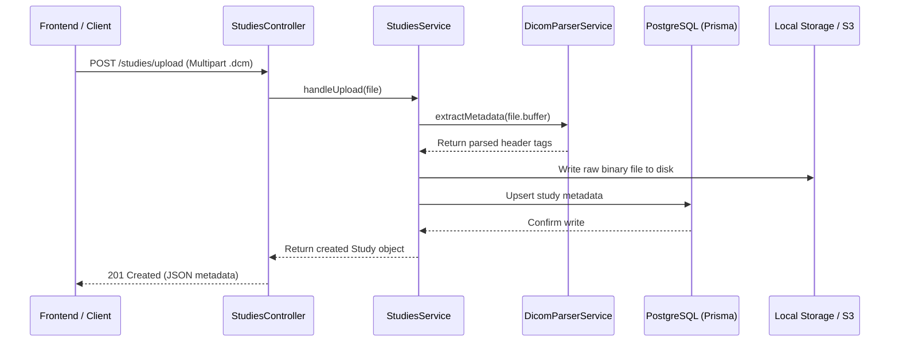

# Mini Teleradiology Viewer - Backend

A high-performance, modular NestJS backend designed for processing, storing, and serving DICOM medical imaging studies. This project serves as a key component of the **Mini Teleradiology Viewer** platform, enabling study upload, metadata parsing, and API delivery for frontend display and rendering.

---

## 🚀 Key Features

*   **Ingestion Pipeline (`POST /studies/upload`)**:
    *   Accepts `.dcm` files via NestJS `FileInterceptor` + `multer`.
    *   Saves the raw binary files locally (with scale-out designs outlined for S3).
    *   Decoupled `DicomParserService` (using `dicom-parser`) to safely extract critical DICOM header tags without loading files entirely into memory.
*   **Study Directory API (`GET /studies`)**:
    *   Serves list of uploaded studies and extracted metadata for frontend grid displays.
*   **Metadata Storage**:
    *   Persists study metadata in PostgreSQL using **Prisma ORM**, keeping raw pixel data decoupled from the database.
*   **Robust Test Suite**:
    *   Unit and integration tests with mocked dependencies to maintain isolated, fast tests.

---

## 🛠️ Technology Stack

*   **Framework**: NestJS (TypeScript)
*   **Database ORM**: Prisma (PostgreSQL)
*   **DICOM Parsing**: `dicom-parser`
*   **Testing**: Jest + `@nestjs/testing`

---

## 📐 System Architecture

### Process Flow


---

## 🗄️ Database Schema

We use Prisma to map out our schema in PostgreSQL. The metadata schema maps only clinical and metadata headers to database columns, avoiding binary bloat in the database.

```prisma
model Study {
  id               String    @id @default(dbgenerated("gen_random_uuid()")) @db.Uuid
  patientId        String    @db.VarChar(100)
  patientName      String?   @db.VarChar(255)
  studyInstanceUid String    @unique @db.VarChar(255) // Globally unique ID
  modality         String    @db.VarChar(50)          // e.g., CT, MR, CR
  studyDate        DateTime? @db.Date
  fileUrl          String    @db.Text                 // Path to raw .dcm file
  fileSize         Int                                // Storage metric in bytes
  createdAt        DateTime  @default(now()) @db.Timestamptz

  @@index([patientId])
  @@index([modality])
  @@map("studies")
}
```

---

## 📦 Getting Started

### 1. Prerequisites
Ensure you have the following installed locally:
*   [Node.js](https://nodejs.org/) (v18 or higher)
*   [PostgreSQL](https://www.postgresql.org/) (running locally on port `5432` or via cloud instance)

### 2. Project Setup
Clone this repository and install dependencies:
```bash
npm install
```

### 3. Environment Configuration
Create a `.env` file in the root directory:
```env
DATABASE_URL="postgresql://<username>:<password>@localhost:5432/dicom_lite?schema=public"
```

### 4. Database Migrations & Prisma Generation
Generate the Prisma client and run migrations to align PostgreSQL:
```bash
# Generate type-safe Prisma client
npx prisma generate

# Apply migrations to database
npx prisma migrate dev --name init_dicom_lite
```

### 5. Running the Application
```bash
# Development (watch mode)
npm run start:dev

# Production build & start
npm run build
npm run start:prod
```

### 6. Running Tests
The project features fast, isolated unit tests using Jest:
```bash
# Run unit tests
npm run test

# Run test coverage
npm run test:cov
```

---

## 🧠 Interview Talking Points & Deep Dives

### 1. Why does DICOM bundle metadata and pixel data together?
The DICOM format encapsulates both clinical metadata (patient name, ID, acquisition settings) and binary pixel data into a single file to ensure **clinical safety**. Bundling guarantees that patient identifiers and acquisition parameters are never dissociated from the diagnostic images themselves, preventing critical data mismatches during clinical workflows or viewer rendering.

### 2. Why is Window/Level (W/L) adjustment necessary?
Medical imaging devices capture high-fidelity pixel data containing 12-bit to 16-bit values (representing 4096 to 65536 distinct gray levels, often expressed in Hounsfield Units for CT). Standard consumer monitors can only display 8-bit colors (256 gray levels). 
Window/Leveling maps a custom subset of interest:
*   **Window Width (W)**: The range of pixel values displayed (controls image contrast).
*   **Window Level (L)**: The center value of the displayed range (controls image brightness).
This mapping lets radiologists isolate specific anatomical details (e.g., bone vs. soft tissue windowing) within the display limits.

### 3. How to scale this backend for 1000s of concurrent studies?
*   **Lazy Loading & Pagination**: The backend implements study-level metadata indexing in PostgreSQL for rapid search, sort, and filtering. Image pixel data is only retrieved on-demand.
*   **Decoupled Binary Storage**: Store raw `.dcm` files on scalable object storage (e.g., AWS S3 or Google Cloud Storage) behind a CDN (e.g., CloudFront) to relieve NestJS of serving heavy binary traffic.
*   **Chunked & Streamed Delivery**: When serving multi-slice series, stream slices frame-by-frame instead of loading whole studies into memory.
*   **WASM Metadata Extraction**: Offload file metadata parsing to WebAssembly (WASM) or optimized C++ worker processes to run heavy file parse jobs off Node.js's main thread loop.
